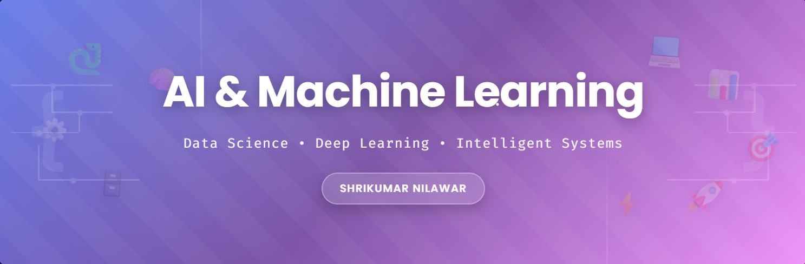

# 👋 Hi, I'm Shrikumar Nilawar
### AI/ML Engineer | Data Science Enthusiast

Welcome to my GitHub! I am passionate about **Machine Learning** and **Artificial Intelligence**. I have completed internships at **ImmverseAI**, **Bharat Intern**, and **Asterics Technocart**, where I worked on building intelligent systems using deep learning, NLP, and large language models.

---

## What I Do

* **Machine Learning:** Building predictive models and end-to-end ML pipelines
* **Deep Learning:** Working with CNNs, Transfer Learning, and Neural Networks
* **AI Systems:** Developing RAG-based applications and LLM integrations
* **Data Analysis:** Extracting insights from data using Python and visualization tools

---

## 🛠️ Tech Stack

| Domain | Technologies |
| :--- | :--- |
| **Programming** | Python, SQL, C |
| **ML/DL Frameworks** | TensorFlow, PyTorch, Scikit-learn, Keras |
| **Data Tools** | Pandas, NumPy, Matplotlib, Seaborn, Power BI |
| **AI/LLM** | FAISS, Transformers, Gradio, RAG Systems |
| **Development** | Jupyter, VS Code, Git, Streamlit, Google Colab |
| **Databases** | MySQL, MongoDB |

---

## Key Projects

### 🩺 **Lung Cancer Prediction Using CNN**
*Deep Learning | Medical Imaging | Transfer Learning*
* Built a CNN-based model with Transfer Learning for detecting lung cancer from medical images
* Deployed as a web application using Streamlit for easy image upload and prediction
* **Tech:** Python, TensorFlow, Streamlit, CNN

### 📄 **PDF AI - RAG System**
*LLM | Semantic Search | Information Retrieval*
* Developed an interactive RAG-based application to query information from uploaded PDFs
* Integrated FAISS for semantic search with intfloat/e5-large-v2 embeddings
* Used Phi-3.5-mini-instruct for intelligent query responses
* **Tech:** Python, Gradio, FAISS, Transformers, LLM

### 📊 **EDA AI Automation**
*Data Analysis | AI Automation | Local LLM*
* Created an automated exploratory data analysis tool powered by LLaMA 3.2 via Ollama
* Generates AI-driven insights and recommendations for datasets
* **Tech:** Python, Ollama, LLaMA, Pandas

---

## 💼 Experience

**AI/ML Intern @ ImmverseAI** *(Dec 2024 – Jul 2025)*
* Worked on high-impact projects involving large language models (LLMs), data handling, and prompt optimization
* Built automation scripts to streamline workflows
* Gained hands-on experience in AI systems and emerging ML techniques

**Machine Learning Intern @ Bharat Intern** *(Jan 2024 – Feb 2024)*
* Developed house price prediction model using linear regression
* Created movie recommendation system with collaborative filtering techniques

**Python Developer Intern @ Asterics Technocart** *(Jul 2023)*
* Developed Python-based applications including parking scheduler and café billing system
* Leveraged Tkinter for GUI development and implemented efficient backend logic

---

## 🌐 Connect with Me

